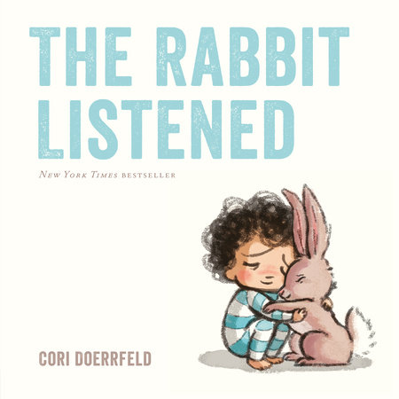

<!-- ======================================================================= -->
<!-- SECTION 2: HTML STRUCTURE                                               -->
<!-- Page layout, header content, filter UI, and article cards               -->
<!-- ======================================================================= -->

<!-- Main page structural container wrappers -->

  

    

      <!-- --- SECTION 2A: Page Header --- -->
      
Writing
 <!-- Small, decorative category label above title -->
      <h1>Articles</h1>          <!-- Main page heading -->
      
Reflections on parenting, meaning, and creativity — thoughts I hope are useful to you as much as they've been to me.
 <!-- Introductory subheader -->

      <!-- --- SECTION 2B: Search Bar --- -->
      

        <!-- Text box used by JavaScript to filter articles by title -->
        <input type="text" id="article-search" placeholder="Search articles..." aria-label="Search articles">
      

      <!-- --- SECTION 2C: Category Filter Buttons --- -->
      <!-- 'data-category' attributes are read by JS to filter items -->
      

        <button class="category-filter-btn active" data-category="all">All</button>
        <button class="category-filter-btn" data-category="parenting">Parenting</button>
        <button class="category-filter-btn" data-category="meaning">Meaning</button>
        <button class="category-filter-btn" data-category="creativity">Creativity</button>
      

      
 <!-- Visual horizontal separator line -->

      <!-- --- SECTION 2D: Featured Article (Static - unaffected by search) --- -->
      <section class="featured-article">
        <h2>Featured</h2>
        <a href="/Articles/2026-07-16-Lessons-from-The-Rabbit-Listened.md" class="featured-card">
          
          

            Parenting
            <h3>The Quiet Work of Showing Up</h3>
            6 min read
            
Some of the most important parenting happens in the moments nobody's watching. A look at what consistency actually asks of us.

          

        </a>
      </section>

      <!-- --- SECTION 2E: Dynamic Article Grid (Targeted by JS) --- -->
      <section class="latest-articles">
        <h2>Latest Articles</h2>
        

          <!-- Individual Article Card 1 -->
          <!-- 'data-category' and 'data-title' allow fast client-side filtering via JS -->
          <a href="/Articles/2026-07-16-Lessons-from-The-Rabbit-Listened.md" class="article-card" data-category="parenting" data-title="Why We Need Both Structure and Play">
            
            

              Parenting
              <h3>Why We Need Both Structure and Play</h3>
              5 min read
              
Kids don't need one or the other — they need both, in the right proportions, at the right moments.

            

          </a>

          <!-- Individual Article Card 2 -->
          <a href="Articles/2026-07-16-Lessons-from-The-Rabbit-Listened.md" class="article-card" data-category="meaning" data-title="Finding Meaning in Ordinary Days">
            
            

              Meaning
              <h3>Finding Meaning in Ordinary Days</h3>
              7 min read
              
Meaning rarely arrives as a lightning bolt. Usually it's stitched together from small, repeated choices.

            

          </a>

          <!-- Individual Article Card 3 -->
          <a href="Articles/2026-07-16-Lessons-from-The-Rabbit-Listened.md" class="article-card" data-category="creativity" data-title="The Creative Habit Nobody Tells You About">
            
            

              Creativity
              <h3>The Creative Habit Nobody Tells You About</h3>
              4 min read
              
The habit that matters most isn't inspiration — it's showing up to the blank page on the boring days.

            

          </a>

          <!-- Individual Article Card 4 -->
          <a href="Articles/2026-07-16-Lessons-from-The-Rabbit-Listened.md" class="article-card" data-category="parenting" data-title="What My Kids Taught Me About Patience">
            
            

              Parenting
              <h3>What My Kids Taught Me About Patience</h3>
              6 min read
              
I thought I was teaching them. Turns out the lessons went both directions.

            

          </a>

          <!-- Individual Article Card 5 -->
          <a href="Articles/2026-07-16-Lessons-from-The-Rabbit-Listened.md" class="article-card" data-category="meaning" data-title="Sitting With Uncertainty">
            
            

              Meaning
              <h3>Sitting With Uncertainty</h3>
              8 min read
              
Not every question needs an answer right away. Some just need company while you carry them.

            

          </a>

          <!-- Individual Article Card 6 -->
          <a href="Articles/2026-07-16-Lessons-from-The-Rabbit-Listened.md" class="article-card" data-category="creativity" data-title="Making Space for Imperfect Work">
            
            

              Creativity
              <h3>Making Space for Imperfect Work</h3>
              5 min read
              
Perfectionism doesn't protect your best work — it usually just keeps it from ever getting made.

            

          </a>

        

        <!-- Fallback message shown by JS if zero cards match search/filters -->
        
No articles match your search.

      </section>

    

  

<!-- ======================================================================= -->
<!-- SECTION 3: JAVASCRIPT                                                   -->
<!-- Client-side filtering logic for search input and category buttons       -->
<!-- ======================================================================= -->

